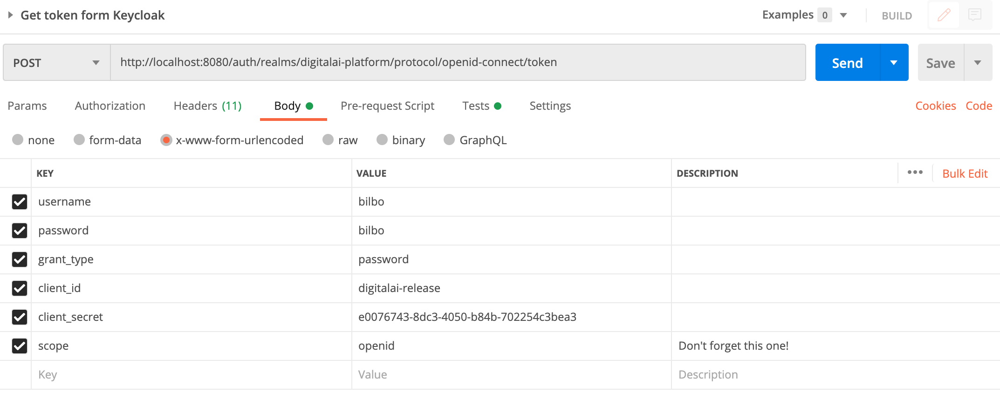
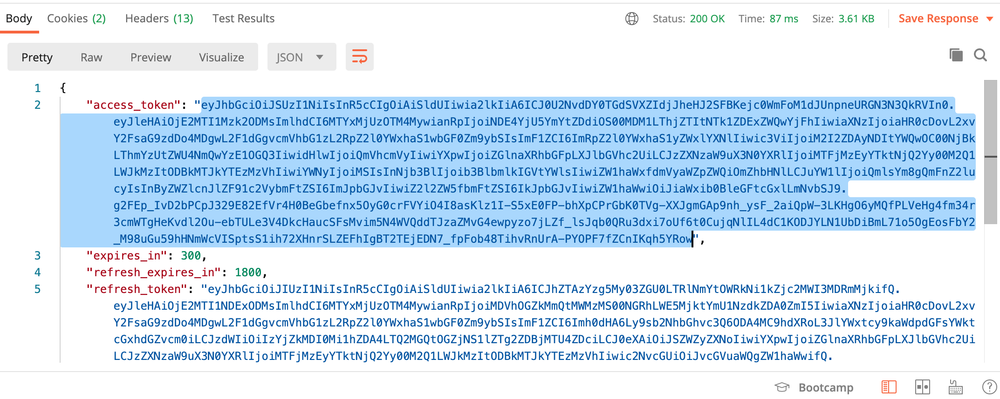
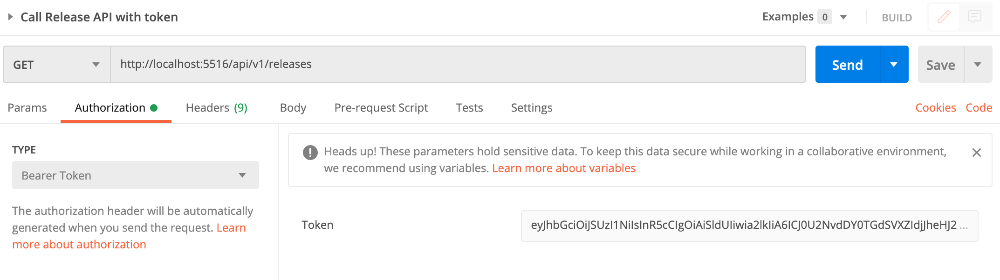
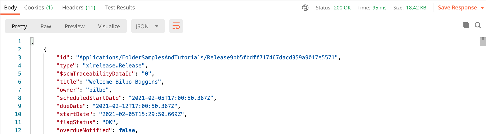

# Digital.ai Release and Deploy with Keycloak

This demo walks you through the steps to set up Digital.ai Release and Deploy with Keycloak and experiment with some cool features around authentication.

**Highlights**

* Single sign-on for Release and Deploy
* Log in with GitHub
* Token access for API calls

The demo is based on Digital Release / Deploy 10.0.0

There's also a video of this demo: [watch the recording here](https://digital.ai/resources/customer-content/online-customer-meetup-advanced-authentication-with-keycloak).

## General setup

### Docker
You need to have Docker installed on your machine before you begin.

* Mac: https://docs.docker.com/docker-for-mac/
* Windows: https://docs.docker.com/docker-for-windows/
* Linux: Refer to the instructions for your Linux distribution on how to install Docker

### Licenses

You need to bring your own XebiaLabs licenses and copy them to the following places

* `docker/xl-deploy/conf/deployit-license.lic`
* `docker/xl-release/conf/xl-release-license.lic`

License files are in `.gitignore` to prevent them from being committed.

### Start & stop

Start all Docker containers:

    $ ./up.sh

To restart Release or Deploy only:

    $ ./restart-release-server.sh
    $ ./restart-deploy-server.sh

To tear down the entire demo:

    $ ./down.sh

## 1. Configure Keycloak

The Docker setup comes with Keycloak integration for Release and Deploy out of the box.

The demo walks you through setting up a connection between Release and Keycloak from scratch again, before going into advanced usage scenarios. 

The setup party largely follows the steps explained in the manual: [Configure OpenID Connect (OIDC) authentication with Keycloak](https://docs.xebialabs.com/v.10.0/release/concept/release-oidc-with-keycloak/)

To enter Keycloak, go to http://localhost:8080 and click on **Administration Console**.

Log in with admin/admin.

### Realm and users

This demo ships with a default Realm already in place: **Digitalai-platform**.

We will use this realm to configure users and identity providers for the Digital.ai products like Release and Deploy.

You can switch Realm to Master -- which contains the users for the Keycloak admin console.

For example, go to the Master realm, click **Users** and press **View all users**. You will see the admin user you just logged in with.

Now go back to the Digitalai-platform realm and again go to **Users**. These are the users that will be able to log in to Release when connected to Keycloak.

Click on user Alice and go into **Role Mappings**. You will see that Alice is a member of the `oidc-developers` group.
 

### Configure a client

A client in Keycloak is an application that connects to it and uses it for user management. In this case, Digital.ai Release.

The demo comes with a preconfigured client setup that works out-of-the-box, but let's walk through the steps needed to confiugre the client and get going. You need to do this only once (in theory). After that, Keycloak will be mostly transparent, except for the login screen as we will see shortly.

Got the **Clients** and press **Create**

Fill in the following values:

* **Client id**: `digitalai-release`
* **Client ID**: `openid-connect`
* **Root ID**: _leave empty_

Note: Release connects to Keycloak through the OIDC protocol and has no SAML support. If you want to connect to SAML you wil have to do so through Keycloak. 
Also, Keycloak has tons of options and it is bewildering at first. We will not explain every field in this demo.

Now edit the newly created client and fill in the following:

* **Access Type**: `confidential`

This will enable a client secret that we need to pass to the Release server.

* **Valid redirect URIs**: `http://localhost:5516/oidc-login`

This is the URI of the Digital.ai Release server. It is localhost because we are running it in Docker. 
 
In **Authentication Flow Overrides** set 

* **Direct Grant Flow**: `direct grant`

Digital.ai Release needs some user information from Keycloak, like email addresses. You can configure this under **Mappers**

Select the following mappers by selecting **Add Builtin**. You can select more than one before applying.

* `username`
* `email`
* `given name`
* `full name`
* `groups`
* `realm roles`

## 2. Configure Digital.ai Release

We quickly toured to bare minimum to set up Keycloak for user authentication. Now let's configure Digital.ai Release to do logins through Keycloak.

We need to do the following

1. Install the `xlr-auth-oidc-plugin` (and remove the default auth plugin)
2. Configure Keycloak in `conf/xl-release.conf`

### Installing the auth plugin

The demo comes prepackaged with the right plugin but in general do the following.

Download the corresponding version of the `xlr-auth-oidc-plugin.jar` from our distribution site http://dist.xebialabs.com/ (Requires login)
Install it in the `plugins/__local__` directory and remove the other auth plugin. They are not mutually compatible. 

Take a look at the [Dockerfile](dockker/xl-release/Dockerfile) to see how to do it in Docker.

### Configuring xl-release-conf

Note that the the demo works out of the box with the canned setup. For the sake of demonstration we will now chang the client to the one we just configured.

Because the demo is in Docker we do it slightly different than a regular server setup. Edit the file `docker/conf/xl-release.conf`. 

Open the file and you will see a snippet under `xl.security.auth.providers.oidc`. In the case of a vanilla server installation you will need to copy this from the Digital.ai Release documentation.

There are two values that need to be edited here

* **clientId**: `digitalai-release`  
* **clientSecret**: _some long crypto string_
  
For the clientSecret go into the Keycloak console and navigate to Clients < digitalai-release > Credentials and copy the value from the **Secret** field.

This is all that was needed. Now let's restart the server. In the demo you can do 

    $ ./restart-release-server.sh
    
Do NOT restart Keycloak, because the setup is not persistent!

Wait until Release starts up (browse the logs)

Now go to the regular login page and you will be redirected to Keycloak!

Log in with alice/alice.

Note that you can 'theme' the login page.

## 3. SSO

Single-sign on (SSO) is easy to enable. We simply need to configure another client for Deploy. The steps are similar for Release but are slightly different in the details. Please refer to the [Configure OIDC authentication with Keycloak](https://docs.xebialabs.com/v.10.0/deploy/concept/deploy-oidc-with-keycloak/) manual for Deploy and follow the instructions. Be careful with copy/pasting snippets from the Release setup.

The demo comes with a Deploy client already preconfigured, so SSO already works!

Except for one additional thing... we need to enable login permissions for Deploy users. Release does not have this explicit permission, anyone with access can login.

We use Devops as-code Yaml files to configure Deploy. Run the following command that will add a role Developers, map it to the `oidc-developers` Keycloak group and give it login permission.

    ./xlw apply -f docker/xl-deploy/enable-developer-login.yaml

Now go to http://localhost:4516 and you are already logged in as Alice!

## 4. Go GitHub!
 
Now let's leverage the power of Keycloak. It's all fine to manage user and roles but let's do something more advanced that comes with Keycloak out-of-the-box and would have cost us some headache to develop.
 
We will enable to log in with your GitHub account.

It's easy to configure. Let's go into Keycloak and select **Identity Providers**

From the list, add **GitHub**

Now Keycloak is a client and needs the Client ID and Client Seceret from GitHub.

Go to GitHub > You > Settings > Developer Settings > OAuth Apps

Create a new app here and fill in a handful of required properties.

* **Application name**: `Keycloak demo`
 
* **Homepage URL:** _A URL from GitHub to Keycloak_
  
GitHub lives in the public internet and needs to find Keycloak that is now (hopefully) running behind a firewall. In order to make a connection, we can punch a hole in the firewall with the `ngrok` utility. This is only for demo purposes! 
 
Try
 
    $ ngrok http 8080
    
And copy to URL to the homepage URL field. Stop the process when done with the demo. Note: you will need to configure GitHub when you start ngrok again because it will give you a different URL.
  
* **Authorization callback URL**:  _Copy it from Keycloak: Identity Providers > GitHub page > Redirect URI._
  
On the next page, copy the **Client ID** into Keycloak.
Then create a new **Secret** and copy it into Keycloak as well.
  
That's it! Save the page in Keycloak and reload the login page. 

There is a 'Login with GitHub' button and it Just Works. How cool is that!
  
You can also use identity providers to connect to Office 365 for example. You will  need to speak to your sysadmin to get hold of the Client ID and Client Secret, but the idea is the same.

  
## 5. Token authorization

We will now leverage the power of Keycloak to enable token access to the API. We don't have to touch Release for this!

We need to add an **Audience** mapper to make this work.

Go to Clients > Digitalai Release > Mappers and now press **Create**

* **Name**: `audience` 
* **Mapper type**: `Audience` (select form dropdown) 
* **Included client audience**: `digitalai-release`. Note that this only works for one client at the time. 

### Test it!

Let's use Postman. You can also use curl or any other HTTP client -- that's the point.

It's a two step plan

1. Get the access token
2. Call the API with the token as authetnitcation, not using username/password.

Since this OAuth there is some ceremony involved.

### Getting the access token

We will ask Keycloak for the token and need to supply username/password. We will do this once and then access the Digital.ai Release API with the token that we receive.

Use the details as follows:

And then copy the actual Base64 encoded token from the result field `access_token`:

### Calling the Digital.ai Release API

Create a new request to query the Release API, for example the release overview on http://localhost:5516/api/v1/releases

Now all you have to do is set the token in Authorization header as a Bearer token:

    Authorization: Bearer <your-token-here>>
    
In the Postman UI:

And we get a familiar looking result:

    
## Appendix

### Exporting the Keycloak configuration

Changes to the Keycloak are not persistent in the demo  after removing and adding the Keycloak container. This section describes how to export the configuration changes so they are picked up when restarting the demo.  

The Keycloack configuration can be exported from The UI, but unfortunately the export is not complete and lacks secrets.

In order to get a complete export, we need to start the Keycloak process with a special parameter and capture the export file that is then being generated.

You can do this with the following Docker command while Keycloak is running

    docker exec -it devops-keycloak-examples_keycloak_1 /opt/jboss/keycloak/bin/standalone.sh \
    -Djboss.socket.binding.port-offset=100 \
    -Dkeycloak.migration.action=export \
    -Dkeycloak.migration.provider=singleFile \
    -Dkeycloak.migration.realmName=digitalai-platform \
    -Dkeycloak.migration.usersExportStrategy=REALM_FILE \
    -Dkeycloak.migration.file=/tmp/digitalai-platform-realm.json

Kill the instance with `^C` once it has started. You can wait for this message in the logs that says:

    WFLYSRV0051: Admin console listening on http://127.0.0.1:10090

Copy the exported file from the Docker container into your demo setup

    docker cp devops-keycloak-examples_keycloak_1:/tmp/digitalai-platform-realm.json docker/keycloak/realm-xlr/

The changes will be picked up when recreating the Keycloak container.

